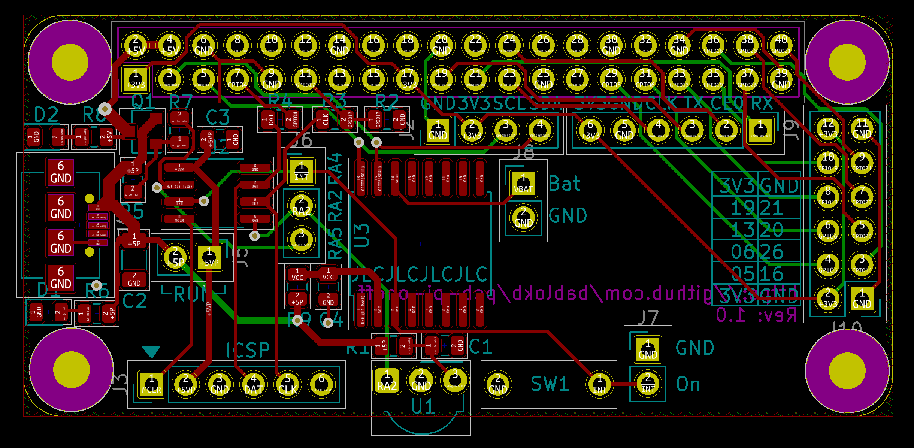
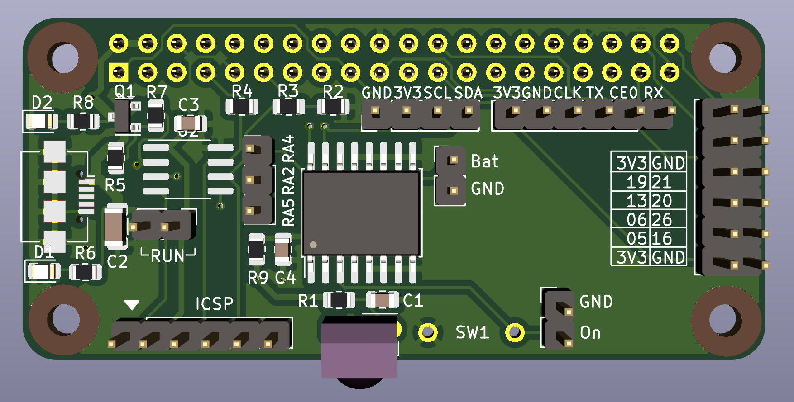

pcb-pi-onoff
============

Overview
--------

This project contains the KiCAD-project-files for a small
power-control pHat. A PIC-MCU controls the power for the Pi. On/off is
via a push-button or an IR-remote. Before cutting current, the PIC
sends a shutdown request to the Pi. Once done, the Pi signals
shutdown-complete to the PIC which in turn cuts power.

Status
------

**this is work-in-progress!**

  - production: OK
  - basic firmware: tested
  - basic functional test: open
  - test with RTC: open
  - IR firmware: open
  - IR test: open

PCB
---

The KiCAD-sources for the pHat are in the sub-directory
[pcb-pi-onoff](pcb-pi-onoff), production-files with
gerber-layers, drill-hole files, bom and pick-and-place-file are in
the sub-directory [production](production). Note that the pcb and the
bom/cpl-files are optimzied for JLCPCB. Please check with your
pcb-factory if these files meet their requirements.

Schematic
---------

Layout
------

3D-View
-------

Configuration
-------------

Please read the description of the [firmware](pic-firmware/README.md) for
how to configure the Pi and the PIC.

License
-------

[![CC BY-SA 4.0][cc-by-sa-shield]][cc-by-sa]

This work is licensed under a
[Creative Commons Attribution-ShareAlike 4.0 International
License][cc-by-sa].

[![CC BY-SA 4.0][cc-by-sa-image]][cc-by-sa]

[cc-by-sa]: http://creativecommons.org/licenses/by-sa/4.0/
[cc-by-sa-image]: https://licensebuttons.net/l/by-sa/4.0/88x31.png
[cc-by-sa-shield]:
https://img.shields.io/badge/License-CC%20BY--SA%204.0-lightgrey.svg
